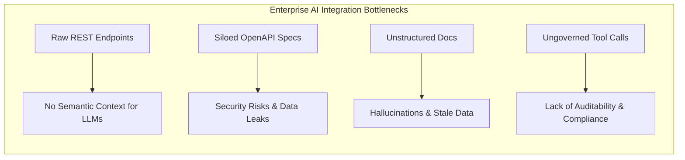
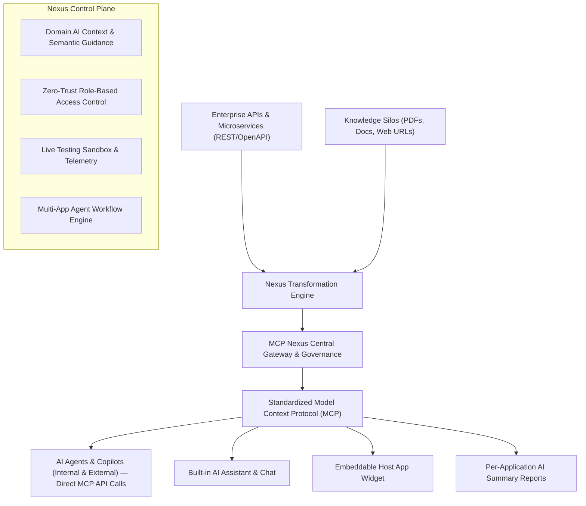
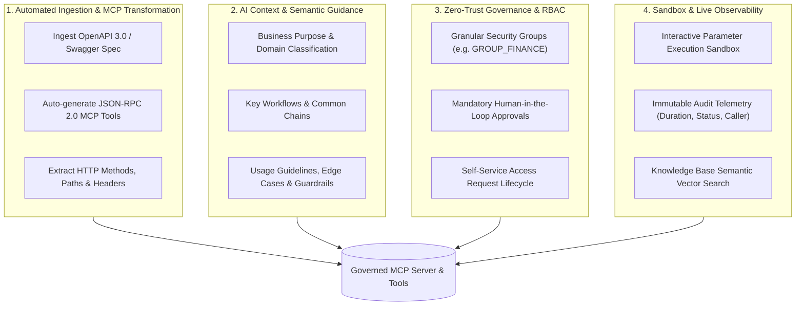
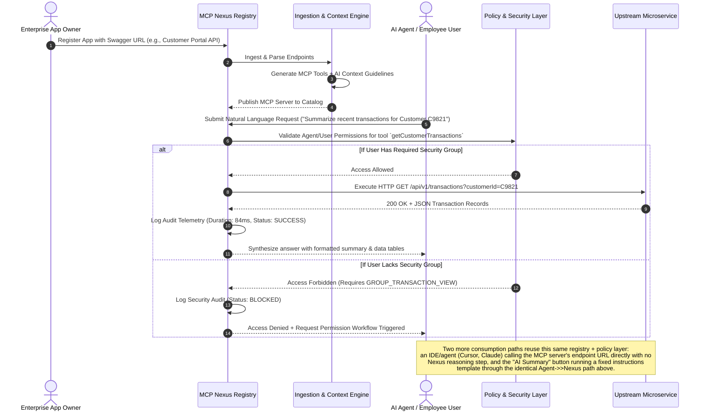

# MCP Nexus Enterprise — Complete Concept & Architecture Guide

## 1. Project Concept & Vision

### What is MCP Nexus?
**MCP Nexus Enterprise** is an enterprise-grade AI and **Model Context Protocol (MCP)** gateway, catalog, and governance orchestration platform.

In modern enterprise architectures, organizations possess hundreds of internal REST microservices, OpenAPI/Swagger specifications, databases, and unstructured knowledge repositories (PDFs, wikis, policy documents). However, contemporary Large Language Models (LLMs) and Autonomous AI Agents (Claude, Gemini, ChatGPT, Cursor, GitHub Copilot, custom internal agents) face fundamental roadblocks when attempting to interact with enterprise systems:

**MCP Nexus solves this by acting as the intelligent, governed bridge:**

---

## 2. The Core Problem: Why REST APIs Alone Are Not AI-Ready

Traditional REST endpoints were built for human software developers and strict programmatic client libraries, not probabilistic reasoning engines (LLMs). When raw REST endpoints are fed directly to an LLM:

1. **Context Blindness**: The LLM does not know business nuances (e.g., *"Does `balance` include pending holds?"*, *"Must `customerId` be queried before executing a debit?"*, *"Which endpoints mutate funds vs read history?"*).
2. **Schema Ambiguity**: Raw OpenAPI definitions often lack precise prompt descriptions, realistic sample payloads, and clear parameter boundaries.
3. **Security & Governance Vulnerability**: Giving an AI model direct API keys exposes entire databases without granular row/tool level permission checks, rate limiting, or approvals for high-risk actions.
4. **Audit Vacuum**: Compliance officers cannot see which prompt caused which tool invocation, by which user, with what parameters.

---

## 3. The Solution: How MCP Nexus Works (Core Pillars)

### Pillar 1: Automated Ingestion & MCP Transformation
Developers or administrators supply an OpenAPI URL or upload a specification. MCP Nexus automatically:
- Parses all endpoints, request bodies, and query parameters.
- Converts each endpoint into a compliant **Model Context Protocol (MCP)** tool definition.
- Assigns transport protocols (Streamable HTTP, Server-Sent Events, or Stdio).

### Pillar 2: AI Context Enrichment
Raw technical schemas are enriched with business intelligence:
- **Business Purpose**: Why this application exists in plain natural language.
- **Intended Consumers**: Who or which agents should call this.
- **Workflow Sequences**: Recommended tool order (e.g., `lookupAccount` -> `verifyKYC` -> `transferFunds`).
- **AI Guidance & Guardrails**: Warnings (e.g., *"Never execute fund transfers exceeding $10,000 without supervisor approval flag"*).

### Pillar 3: Zero-Trust Governance & Access Requests
- **Role-Based Access Control**: Users and agents are assigned security groups (e.g., `GROUP_CORE_BANKING`, `GROUP_TRANSACTION_VIEW`, `GROUP_ADMIN`).
- **Permission Elevation**: If an agent or employee attempts an unauthorized tool execution, Nexus intercepts the call, blocks execution, logs the denial, and provides an immediate self-service access request pathway.

### Pillar 4: Interactive Sandbox & Observability
- **Tool Sandbox Studio**: Test any tool in isolation with preset enterprise payloads before deploying to production agents.
- **Immutable Audit Trail**: Real-time logging of user ID, tool name, response payload latency, HTTP status code, and parameter payloads.

---

## 4. Complete Application Flow & Lifecycle

---

## 5. Architectural Components Breakdown

### 1. Frontend Shell & Navigation
- **Responsive Workspace**: Clean layout with customizable, resizable sidebar splitter (220px–520px) and fast keyboard navigation.
- **Live Theme Engine**: 5 distinct themes (Enterprise Indigo, Cyber Obsidian Terminal, Nordic Frost Glacier, Tokyo Synthwave, and Warm Copper & Espresso).

### 2. Control Plane Modules
- **Dashboard (`Dashboard.tsx`)**: Real-time operational intelligence, server health, active tools, API sync status, and request throughput.
- **API Discovery & Registration (`ApiDiscoveryView.tsx`, `RegisterAppWizard.tsx`, `ApplicationDetailModal.tsx`)**: Flattened index of every discovered endpoint plus the step-by-step wizard to register a new OpenAPI spec — capture the Swagger URL, choose an enterprise auth mechanism (AuthBlue, IDaaS/One Identity, or generic OAuth via `ApiAuthConfigEditor.tsx`), configure AI context, review endpoints, and publish the generated MCP server. Each application's detail view also has an **AI Summary Instructions** tab — an admin-authored briefing template for that app, rendered on demand as an "AI Summary" button in AI Chat.
- **MCP Catalog & Servers (`McpCatalogView.tsx`, `McpServersView.tsx`)**: Unified registry of all MCP servers with transport configurations (Streamable HTTP, SSE, Stdio) and self-service access requests. These are the same endpoint URLs that external IDEs/agents (Claude, Cursor) call **directly over the MCP protocol** — no built-in chat required.
- **MCP Tools & Configuration (`McpToolsView.tsx`, `McpToolConfigModal.tsx`)**: Tool inspector, JSON parameter schema modifier, and security group assignment.
- **Interactive Tool Sandbox (`ToolTesterModal.tsx`)**: Real-time tool simulation bench with sample inputs, live JSON execution, and latency metrics.
- **MCP Orchestrator (`McpOrchestratorView.tsx`)**: A guided, live simulation bench for the platform's harder orchestration scenarios — chaining tools across multiple MCP servers in one exchange, walking an enterprise IAM/auth handshake, and grounding an answer in indexed knowledge (SOP) content — so the mechanics behind Pillars 1–4 can be seen executing end-to-end.
- **AI Copilot (`AiChatView.tsx`)**: Interactive multi-turn chat assistant that autonomously calls registered MCP tools, inspects arguments, formats structured responses, and surfaces any configured AI Summary as a one-click report.
- **AI Workflows (`AiWorkflowsView.tsx`)**: Multi-step orchestrations chaining tools across distinct applications (e.g., Identity Verification -> Risk Assessment -> CRM Update).
- **Knowledge Hub & Search (`KnowledgeHubView.tsx`, `KnowledgeSearchView.tsx`)**: Central repository for enterprise documents, crawled web knowledge, and semantic search.
- **Users & Governance (`UsersAccessView.tsx`, `AccessRequestsView.tsx`, `AuditView.tsx`)**: User directory (with `PersonTypeahead.tsx` for directory-backed people search), API key rotation, RBAC approvals, and compliance audit trail.
- **Documentation (`DocsView.tsx`)**: In-app, GitHub-style rendering of this document and the README — with a live section outline and rendered Mermaid diagrams — so the concept guide never drifts from a separate hosted copy.
- **Embed Widget Studio (`EmbedWidgetModal.tsx`, `AppEmbedPreviewModal.tsx`)**: Multi-language code generator (React, HTML/JS, Python, Node.js) and interactive host application simulator.

---

## 6. How to Use & Extend MCP Nexus

### Adding a New Enterprise Application
1. Click **Register Application** on the API Discovery or Dashboard page.
2. Provide the OpenAPI/Swagger URL (or paste specification JSON/YAML) and select an auth mechanism (AuthBlue, IDaaS, or OAuth).
3. Fill in the **AI Context** (Business Purpose, Key Use Cases, Usage Guidelines).
4. Review the auto-generated MCP tools and confirm registration.

### Embedding the Widget in Your Products
1. Click **Embed Widget** in the top header.
2. Select your target framework (React, Vanilla HTML, Python REST, or Node.js).
3. Copy the generated code snippet and configure the host application URL.
4. Click **Live Test in App** to preview the floating AI Assistant inside a simulated host portal.

### Reading This Documentation In the Browser
Open the **Documentation** item under Administration in the sidebar to read this file and the README as a rendered page — same headings, tables, and Mermaid diagrams, always sourced live from the two `.md` files in the repo root.
