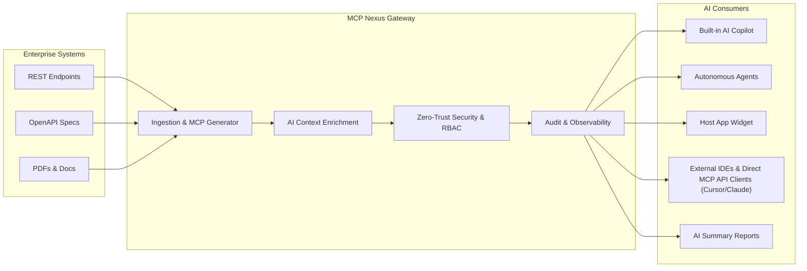
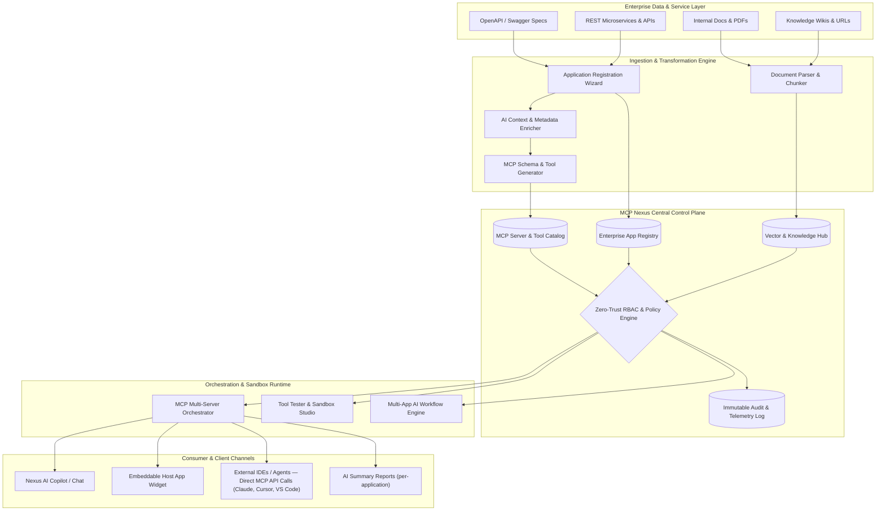
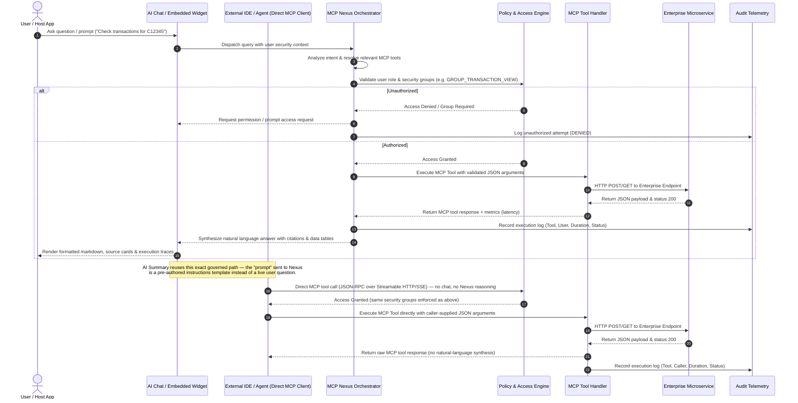
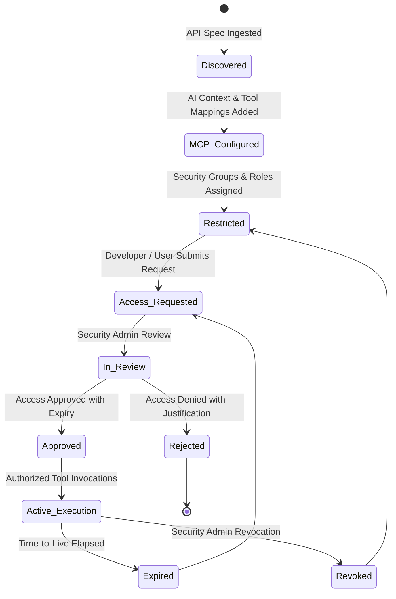

# MCP Nexus Enterprise — Architecture, Concept & Developer Guide

**MCP Nexus** is an enterprise-grade AI and Model Context Protocol (MCP) platform that bridges enterprise application APIs, microservices, and knowledge silos with Large Language Models and AI Agents. It transforms OpenAPI/Swagger specifications into governed, secure, domain-aware MCP servers and executable tools with Zero-Trust Role-Based Access Control (RBAC), auditing, live sandboxes, and embeddable widget capabilities.

> 📖 **Deep Concept Documentation**: For an in-depth philosophical, conceptual, and domain breakdown, refer to [`PROJECT_CONCEPT.md`](./PROJECT_CONCEPT.md). Both this file and that one also render as a rich, GitHub-style page with live Mermaid diagrams inside the running app — open **Documentation** in the sidebar (under Administration).

---

## 📑 Table of Contents

- [1. Executive Summary & Project Description](#1-executive-summary--project-description)
  - [The Core Problem: Why REST Endpoints Aren't AI-Ready](#the-core-problem-why-rest-endpoints-arent-ai-ready)
  - [The MCP Nexus Solution](#the-mcp-nexus-solution)
- [2. System Architecture & Workflows](#2-system-architecture--workflows)
  - [High-Level Architecture Diagram](#high-level-architecture-diagram)
  - [End-to-End Query & Execution Flow](#end-to-end-query--execution-flow)
  - [Governance & Access Lifecycle Flow](#governance--access-lifecycle-flow)
  - [Multi-App AI Workflow Chaining](#multi-app-ai-workflow-chaining)
- [3. Feature Modules & Capabilities](#3-feature-modules--capabilities)
- [4. Component & File Directory Structure](#4-component--file-directory-structure)
- [5. Core Domain Models & Data Structures](#5-core-domain-models--data-structures)
- [6. Multi-Theme Engine](#6-multi-theme-engine)
- [7. Development, Build & Scripts](#7-development-build--scripts)
- [8. Extensibility & Future Development Guide](#8-extensibility--future-development-guide)

---

## 1. Executive Summary & Project Description

Modern enterprise software landscapes contain hundreds of disparate internal REST APIs, microservices, databases, and unstructured document silos. While autonomous AI agents and LLMs (such as Gemini, Claude, and internal GPT assistants) possess immense natural language reasoning capabilities, connecting them safely and reliably to enterprise infrastructure presents critical challenges.

### The Core Problem: Why REST Endpoints Aren't AI-Ready
1. **Context Blindness**: REST APIs were designed for human developers and programmatic SDKs. LLMs lack contextual knowledge about business workflows, required execution order, data sensitivity, and edge-case caveats.
2. **Ungoverned Data Access**: Handing raw API keys to an AI agent risks unintended data exfiltration or unintended state mutation (e.g., executing high-value payments or modifying production records without supervisor oversight).
3. **Absence of Auditability**: Standard API gateways do not correlate AI conversation prompts and reasoning steps with backend tool invocations, making compliance and regulatory verification difficult.
4. **Tool Fragmentation**: AI agents must juggle disparate schemas, auth headers, and response formats without a unified orchestration layer.

### The MCP Nexus Solution
MCP Nexus implements the **Model Context Protocol (MCP)** — an open standard developed to provide structured context, tools, and resources to AI models in a unified, bidirectional protocol.



**Key Pillars of MCP Nexus:**
1. **Automated API-to-MCP Server Transformation**: Ingests OpenAPI/Swagger URLs or raw specs and automatically generates JSON-RPC 2.0 compatible MCP tools with schema validation.
2. **AI Context Enrichment**: Injects business domains, critical usage guidelines, workflows, and sample payloads so AI models understand *why*, *when*, and *how* to invoke each tool.
3. **Zero-Trust Governance & RBAC**: Enforces granular security groups (e.g., `GROUP_TRANSACTION_VIEW`, `GROUP_CORE_BANKING`), role hierarchies, and self-service approval workflows.
4. **Interactive Sandbox & Telemetry**: Live workbench to simulate tool execution with sample inputs, latency timers, and schema validation before deployment.
5. **Unified Knowledge Hub**: Merges unstructured documents, policy manuals, and web wikis into a searchable semantic knowledge store.
6. **Multi-Channel Deployment**: Every governed MCP server can be consumed four ways — the interactive AI Copilot, an embeddable customer/employee widget, **direct MCP protocol access** by external IDEs/agents (Claude, Cursor) calling tools without going through the built-in chat at all, and pre-configured **AI Summary reports** (a per-application, admin-authored natural-language briefing, surfaced as an "AI Summary" button in AI Chat — see `ApplicationDetailModal.tsx`'s AI Summary Instructions tab).

---

## 2. System Architecture

### High-Level Architecture Diagram



---

### End-to-End Query & Execution Flow



---

### Governance & Access Lifecycle Flow



---

## 3. Feature Modules & Capabilities

| Module | Route / View | Description | Key Components |
| :--- | :--- | :--- | :--- |
| **Dashboard** | `dashboard` | Executive overview of total MCP servers, active tools, API sync health, uptime, request throughput, and real-time execution graphs. | `Dashboard.tsx` |
| **API Discovery** | `api-discovery` | Flattened catalog of all discovered REST endpoints with HTTP methods, paths, MCP enablement toggles, and direct inspector links. Registering a new application (Swagger URL, AI context, auth mechanism, endpoint review) also happens from here via the Registration Wizard. Each application's detail view also configures its **AI Summary** — an admin-authored, per-app briefing template surfaced as an "AI Summary" button on the AI Chat page. | `ApiDiscoveryView.tsx`, `RegisterAppWizard.tsx`, `ApplicationDetailModal.tsx` |
| **MCP Catalog** | `mcp-catalog` | Comprehensive index of all MCP servers and tools with category filtering, search, capability badges, and self-service access requests. | `McpCatalogView.tsx` |
| **MCP Servers** | `mcp-servers` | Server instances management, health status, connection protocol (Streamable HTTP, SSE, Stdio), and endpoint URLs — the same endpoints external IDEs/agents (Claude, Cursor) call directly over the MCP protocol, independent of the built-in AI Chat. | `McpServersView.tsx` |
| **MCP Tools** | `mcp-tools` | Granular tool inventory with schema parameters, security group bindings, configuration editor, and direct test links. | `McpToolsView.tsx`, `McpToolConfigModal.tsx` |
| **Tool Tester Sandbox**| Modal | Interactive workbench to simulate tool execution with sample payloads, JSON validation, response inspector, and latency benchmarking. | `ToolTesterModal.tsx` |
| **MCP Orchestrator** | `mcp-orchestrator` | Live simulator for multi-MCP-server tool chaining, enterprise IAM/auth handshakes, and knowledge-grounded SOP scenarios end-to-end. | `McpOrchestratorView.tsx` |
| **AI Copilot & Chat** | `ai-chat` | Multi-turn conversational interface with tool calling visualization, markdown tables, code copy, and prompt suggestions. | `AiChatView.tsx` |
| **AI Workflows** | `ai-workflows` | Visual multi-step chain execution linking multiple applications (e.g. KYC Verification -> Risk Scoring -> Account Provisioning). | `AiWorkflowsView.tsx` |
| **Conversations** | `conversations` | Historical log of AI chat sessions with token counts, tool usage tags, full message threads, and resume capability. | `ConversationsView.tsx` |
| **Knowledge Hub** | `knowledge-hub` | Centralized manager for enterprise documents and crawled web sources, with category tagging and indexed-chunk counts. | `KnowledgeHubView.tsx` |
| **Knowledge Search** | `knowledge-search`| Semantic retrieval search bar showing relevance scores, document matches, and excerpt highlights. | `KnowledgeSearchView.tsx` |
| **Access Requests** | `access-requests` | Self-service permission requests for restricted MCP tools with one-click approve/reject actions and justification trails. | `AccessRequestsView.tsx` |
| **Users & Access** | `users-access` | User directory, role assignment, API key generator, security group memberships, and status management. | `UsersAccessView.tsx`, `PersonTypeahead.tsx` |
| **Audit & Governance**| `audit` | Comprehensive audit trail logging every tool execution, caller ID, security validation, duration, and error codes. | `AuditView.tsx` |
| **Documentation** | `documentation` | Rich, in-app viewer that renders this README and `PROJECT_CONCEPT.md` with GitHub-style typography, a live outline, and rendered Mermaid diagrams — always in sync with the source files. | `DocsView.tsx` |
| **Embed Widget Studio**| Modal | Code generator and live simulator for embedding MCP Nexus AI assistant widgets into React, Vanilla JS, Python, or Node.js apps. | `EmbedWidgetModal.tsx`, `AppEmbedPreviewModal.tsx` |
| **Platform Settings** | `settings` | Global protocol configurations (HTTP/SSE), auth modes, concurrency limits, rate limiting, and interface appearance switcher. | `SettingsView.tsx` |

---

## 4. Component & File Directory Structure

```text
/
├── metadata.json                 # Platform capabilities, title, description
├── package.json                  # Dependencies & Vite build scripts
├── vite.config.ts                # Vite configuration with Tailwind CSS plugin
├── tsconfig.json                 # TypeScript compiler configuration
├── index.html                    # Single-Page Application entry point
├── src/
│   ├── main.tsx                  # React DOM root with ThemeProvider wrapper
│   ├── App.tsx                   # Central App router, shell state, and modals coordinator
│   ├── index.css                 # Global Tailwind CSS and 5 comprehensive theme definitions
│   ├── types.ts                  # Central TypeScript data interfaces and enums
│   │
│   ├── context/
│   │   └── ThemeContext.tsx      # Theme context (Indigo, Obsidian, Frost, Synthwave, Copper)
│   │
│   ├── data/
│   │   ├── initialData.ts        # Comprehensive seed datasets for enterprise apps, tools, knowledge, audit
│   │   └── people.ts             # Enterprise directory used by PersonTypeahead
│   │
│   └── components/
│       ├── Header.tsx                 # Top app bar with search, quick actions, theme picker, profile
│       ├── Navigation.tsx             # Resizable sidebar with draggable splitter and collapse toggle
│       ├── Dashboard.tsx              # KPI metrics, activity feeds, tool usage charts
│       ├── ApplicationDetailModal.tsx # Detailed app inspector (Swagger URL, AI Context, MCP mapping)
│       ├── RegisterAppWizard.tsx      # Step-by-step registration wizard for new OpenAPI specs
│       ├── ApiAuthConfigEditor.tsx    # Auth mechanism editor (AuthBlue, IDaaS/One Identity, OAuth)
│       ├── PersonTypeahead.tsx        # Directory-backed people search/select (app owners, requesters)
│       ├── ApiDiscoveryView.tsx       # Global discovered endpoints table & filter
│       ├── McpCatalogView.tsx         # Unified MCP servers & tools card catalog
│       ├── McpServersView.tsx         # MCP server instance list & connection telemetry
│       ├── McpToolsView.tsx           # MCP tool cards with configuration and test triggers
│       ├── McpToolConfigModal.tsx     # JSON schema editor, parameter guidelines, security groups
│       ├── ToolTesterModal.tsx        # Live tool execution sandbox with sample payloads
│       ├── McpOrchestratorView.tsx    # Multi-MCP orchestration & IAM/knowledge scenario simulator
│       ├── AiChatView.tsx             # Conversational agent interface with live tool calling
│       ├── ConversationsView.tsx      # Historical conversation archive and replay
│       ├── AiWorkflowsView.tsx        # Multi-tool chaining and workflow execution
│       ├── KnowledgeHubView.tsx       # Knowledge manager for documents & crawled web sources
│       ├── KnowledgeSearchView.tsx    # Semantic retrieval search interface
│       ├── UsersAccessView.tsx        # User management, API key rotation, RBAC groups
│       ├── AccessRequestsView.tsx     # Permission request triage and approvals
│       ├── AuditView.tsx              # Governance audit trail and filterable log viewer
│       ├── DocsView.tsx               # In-app rich viewer for README.md & PROJECT_CONCEPT.md
│       ├── EmbedWidgetModal.tsx       # Embeddable widget code generator (React, HTML, REST, Python)
│       ├── AppEmbedPreviewModal.tsx   # Live host application iframe simulator with floating widget
│       ├── SettingsView.tsx           # System transport settings and theme picker
│       ├── ThemeSwitcherControl.tsx   # Header dropdown theme selector
│       └── ThemeSwitcherModal.tsx     # Rich visual theme selector modal with palette swatches
```

---

## 5. Core Domain Models & Data Structures

Key data types located in `src/types.ts`:

### Enterprise Application (`EnterpriseApplication`)
Represents an upstream microservice or system:
```typescript
interface EnterpriseApplication {
  id: string;
  name: string;
  appCode: string;
  description: string;
  department: string;
  owner: string;
  apiCount: number;
  mcpServerId?: string;
  mcpServerName?: string;
  mcpToolsCount?: number;
  status: 'Active' | 'Pending' | 'Disabled' | 'Maintenance';
  isAiReady: boolean;
  lastUpdated: string;
  swaggerUrl?: string;
  aiContext?: {
    businessPurpose: string;
    businessDomain: string;
    keyUseCases: string[];
    commonWorkflows: string[];
    importantTerminology: string[];
    intendedConsumers: string[];
    usageGuidelines: string[];
    restrictions: string;
    aiGuidance: string;
  };
  apis: DiscoveredApi[];
}
```

### MCP Tool (`McpTool`)
Represents an individual executable function exposed to AI models:
```typescript
interface McpTool {
  id: string;
  name: string;
  displayName: string;
  description: string;
  mcpServerId: string;
  mcpServerName: string;
  appId: string;
  appName: string;
  category: string;
  status: 'Active' | 'Beta' | 'Deprecated' | 'Disabled';
  requiresApproval: boolean;
  requiredSecurityGroups: string[];
  parameters: McpToolParameter[];
  sampleInputs: { id: string; label: string; payload: Record<string, any> }[];
  sampleOutputs: { id: string; label: string; payload: Record<string, any> }[];
}
```

---

## 6. Multi-Theme Engine

MCP Nexus features a theme engine with live switching, persistence via `localStorage`, and CSS variables configured in `src/index.css`:

1. **Enterprise Indigo** (`enterprise-indigo`): Clean, high-contrast light SaaS layout with indigo and slate accents.
2. **Cyber Obsidian Terminal** (`cyber-obsidian`): Deep dark OLED canvas (`#060911`) with glowing neon cyan/emerald badges and cyber command styling.
3. **Nordic Frost Glacier** (`nordic-frost`): Crisp Scandinavian cool slate with arctic glacier teal borders and airy spacing.
4. **Tokyo Synthwave** (`synthwave-neon`): Dark midnight violet canvas (`#090614`) with electric magenta accents and ultraviolet gradients.
5. **Warm Copper & Espresso** (`luxury-amber`): Cashmere paper canvas (`#f7f2ea`) with rich bronze copper and dark espresso typography.

---

## 7. Development, Build & Scripts

### Prerequisites
- **Node.js**: v18.0.0 or higher
- **npm**: v9.0.0 or higher

### Key Scripts in `package.json`

| Command | Action |
| :--- | :--- |
| `npm run dev` | Boots the Vite development server on `0.0.0.0:3000`. |
| `npm run build` | Compiles the React application into production-ready static files in `dist/`. |
| `npm run preview` | Starts a local server to preview the production build in `dist/`. |
| `npm run lint` | Runs TypeScript type checker (`tsc --noEmit`) to validate types and interfaces. |

### Configuration Highlights
- **Vite & Tailwind CSS v4**: Uses `@tailwindcss/vite` for fast build compilation without PostCSS configuration files.
- **Icons**: Standardized on `lucide-react` across all components.
- **Motion**: Fluid animations using `motion/react`.
- **Docs Viewer**: The in-app `Documentation` page (`DocsView.tsx`) imports this README and `PROJECT_CONCEPT.md` at build time via Vite's `?raw` import, and renders them with `marked` (Markdown → HTML) and `mermaid` (diagram rendering) — so the browser view always matches these source files exactly.

---

## 8. Extensibility & Future Development Guide

When extending MCP Nexus with new capabilities, follow these patterns:

1. **Adding a New MCP Server / Application**:
   - Add sample definitions in `src/data/initialData.ts`.
   - Update `types.ts` if new schema attributes (e.g. streaming responses, Webhooks) are needed.
   - Wire any new modal or drawer into `src/App.tsx`.

2. **Adding Backend API Integrations**:
   - If connecting to live backend endpoints or Gemini API keys, implement server-side proxies (`/api/*`) in an Express server layer (`server.ts`).
   - Store all sensitive API keys server-side via `process.env`.

3. **Draggable Sidebar & Layout Resizing**:
   - The navigation component (`src/components/Navigation.tsx`) includes a responsive resize handle. You can adjust the minimum (`220px`) and maximum (`520px`) constraints in the component constants.

4. **Security & RBAC Enforcement**:
   - Check `u.securityGroups` against `tool.requiredSecurityGroups` prior to executing any simulated tool calls in `ToolTesterModal.tsx` or `AiChatView.tsx`.
